# Restaurant Booking App

A application built using Django for The White Horse restaurant in Shepshed. Allows for users to register and make reservation requests. These requests can then be viewed, amended and deleted by the user as required. Representatives of the venue are also able to accept or decline these requests and view all reservations in order to make business decisions. Key contact details and the restaurants menu are also provided within the application, as well as links to the companies social media accounts.
___
## Table of Contents 

* [User Experience (UX)](#userexperience)
* [Design](#design)
* [Development](#development)
* [Database Schema](#database)
* [Existing Features](#existingfeatures)
* [Features Left to Implement](#toimplement)
* [Testing](#testing)
* [Unfixed Bugs](#bugs)
* [Deployment](#deployment)
* [Create a Clone](#clone)
* [Technologies Used](#tech)
* [Credits](#credits)
___
### User Experience (UX) 

* reason for site
* target audience
* purpose owner/user goals needs addressed
* data required, security features

[Return to Table of Contents](#contents)
___
### Design 

- **Colour Scheme**

    *A contrasting color scheme of predominantly black and white is used across the site, this scheme is chosen to represent the name of the restaurant.*

- **Typography**

- **Imagery**

    *There is limited use of imagery within the project as i felt a minimalist approach was an elegant solution that reflected the establishment growing into a contemporary venue. The hero image and the interactive map are the only doses ov color on the site, although there is future features that plan to expand on this. 

- **Layout**

    *The app is built using a multi-page layout, with the navigation bar and footer, which contains key contact and business details, present on every page. The menu section is broken down into sections which can be navigated to from the dropdown menu in the navbar or from the buttons on each sections page.*

[Return to Table of Contents](#contents)
___
### Development 

*The project was developed using an agile methodology, with epics broken down into user stories with well defined acceptance criteria and tasks. These issues where then worked on in incremental steps. The sprint times for my iterations was roughly two weeks, dependant on my commitments outside of the project. The story points applied to my issues follow the fibonacci scale, with the 'Must Have' issues for each iteration kept at 60% of the total timebox.*

- **Product Backlog**
    * The product backlog for the project can be found [here](https://github.com/LewisCM14/restaurant-booking-app/milestone/1)

- **Iteration 1**
    * The iteration 1 milestone can be found [here](https://github.com/LewisCM14/restaurant-booking-app/milestone/2?closed=1)
    * Iteration 1 board can be found [here](https://github.com/LewisCM14/restaurant-booking-app/projects/1)

- **Iteration 2**
    * The iteration 2 milestone can be found [here](https://github.com/LewisCM14/restaurant-booking-app/milestone/3?closed=1)
    * Iternation 2 board can be found [here](https://github.com/LewisCM14/restaurant-booking-app/projects/2)

- **Iteration 3**
    * The iteration 3 milestone can be found [here](https://github.com/LewisCM14/restaurant-booking-app/milestone/4?closed=1)
    * Iteration 3 board can be found here [here](https://github.com/LewisCM14/restaurant-booking-app/projects/3)

- **Iternation 4**
    * The Iternation 4 milestone can be found [here](https://github.com/LewisCM14/restaurant-booking-app/milestone/5?closed=1)
    * Iteration 4 board can be found here [here](https://github.com/LewisCM14/restaurant-booking-app/projects/4)
    
    *Although the issue for automated emails was started in iteration 3, once iteration 4 began i felt it was outside of the scope for this project and placed back in the product backlog for a later date.*

[Return to Table of Contents](#contents)
___

### Database Schema 

* The final schema for the Booking model database can be seen below. Although it went through various iterations in development the final schema takes in the user from the user model, which is used for logic in the view. The lead and email fields are also taken from the user model. With the fields required to make a booking also stored in the database. These include: mobile, date, time, notes and guests. The status field is also stored here, this field relates to admin functionality and is set off a tuple provided in the model file. Please note the lead field is populated with the first_name and last_name fields from the user model.
    
    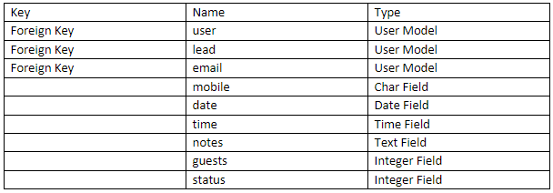

* The schema for the databases located with the menu models can be seen below. The title field is taken in as the main display name for each item in the menu. With the description field a text field that utilizes the summernotes WYSIWYG editor. The price is a decimal field for correct display. the image field, intended for a future feature, is a cloudinary field and the display field, which is used for logic in the view is a integer field that utilizes a tuple set within the model file. There is a separate database for each category of the menu, these include: Starter, Main and Dessert.

    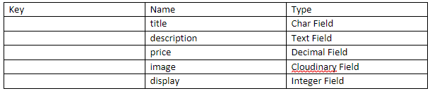

[Return to Table of Contents](#contents)
___
### Existing Features 

- **Landing Page**
    * The landing page features a hero image with a brief description of the restaurant, it's facilities and accessibility level. The landing page is fully responsive built using bootstrap and allows for users with admin privileges to alter the hero image through the admin panel. This feature is designed to help implementation of a future hero image carousel feature.
    
        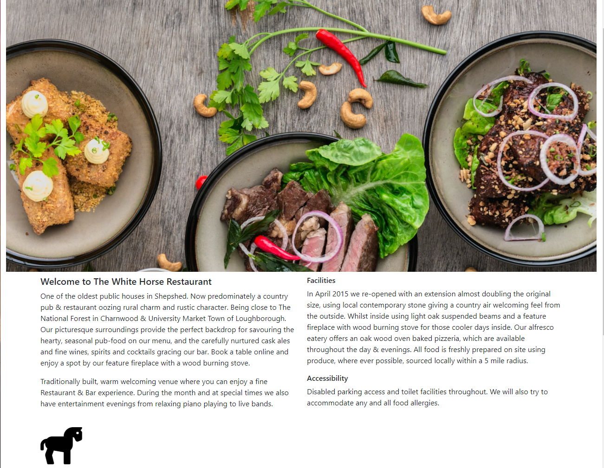

- **Navigation**
    * The navigation bar is fully responsive, utilizing a hamburger data toggler past the large breakpoint. It also responds to the authorization status of the user. If a user is not signed in and attempts to navigate to the 'make a booking' section they are directed to the account sign in page. The reservations and logout tab are only visible to authorized users, with the users first and last name displayed to them from the nav bar once singed in. The restaurant name is always displayed to the left hand side at any break point. A dropdown link is used on the menu tab for navigation between the different menu catagories. The nav bar is present across all pages of the website, as it provides main source of navigation between content. 

        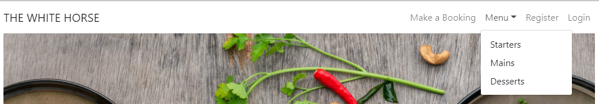
        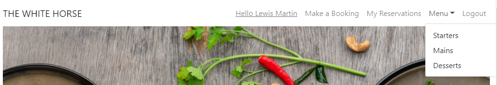

- **Footer**
    * The footer contains key contact details and opening hours regarding the restaurant. Built to be fully responsive, it utilizes the MapBox API to contain an interactive map centered on the restaurants location. It also contains the social media links for the venue.
        
        * [Business Details](https://github.com/LewisCM14/restaurant-booking-app/issues/7)
        ---
        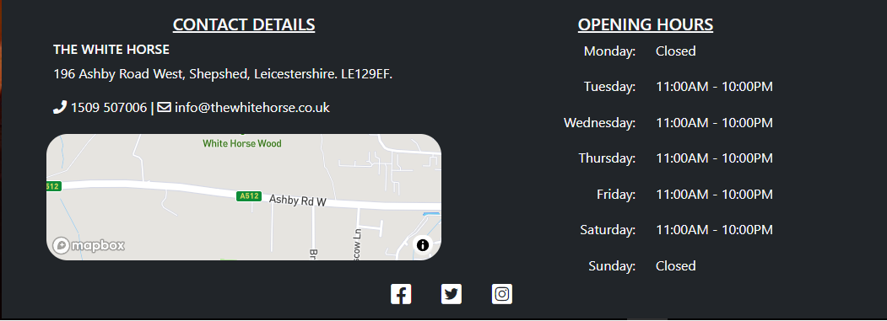

- **User Creation**
    * User creation uses the allauth package to collect the necessary information needed by the company for account creation. Once an account is created the email and password set are used as the login credentials.
        
        * [Account Registration](https://github.com/LewisCM14/restaurant-booking-app/issues/1)
        ---
        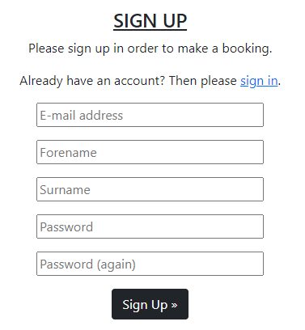

- **Booking Form**
    * The booking form collects all the information needed for the venue to make a decision on if they can accommodate a reservation request. The booking lead and email are taken from the user model, with the input fields including: mobile, date, time, special requirements and amount of guests. Extensive validation and user feedback is preformed on these fields (as listed below). All fields bar the special requirements field are required, this field being optional. For the date and time fields the input is handled by inbuilt django widgets. Upon making a request to amend a reservation this same form is pre-populated with the existing reservations details and upon a valid request the instance is updated within the database. Double bookings are prevented via a unique constraint on the user, date and time fields from within the model, with user feedback handled at the top of the form in the instance of a double booking.
        
        * Mobile - Regex Validation.
        * Date - Validation to ensure it's a future date and a day the venue is open.
        * Time - Validation to ensure the requested time is within opening hours.
        * Special Requirements - Validation to ensure there is a character limit of 200.
        * Guests - Validation to ensure it's a minimum of one guests and does not exceed eight guests.
        * Amend Reservation - Ensures the user attempting to alter the reservation is the owner.
        ---
        * [Special Requirements](https://github.com/LewisCM14/restaurant-booking-app/issues/8)
        * [Double Bookings](https://github.com/LewisCM14/restaurant-booking-app/issues/6)
        * [View all Bookings](https://github.com/LewisCM14/restaurant-booking-app/issues/5)
        * [Create a Booking](https://github.com/LewisCM14/restaurant-booking-app/issues/2)
        ---
        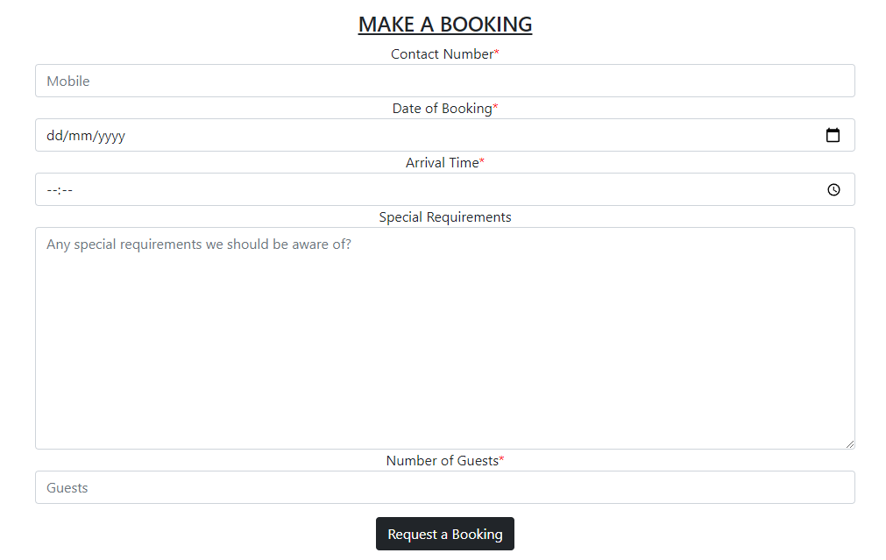
        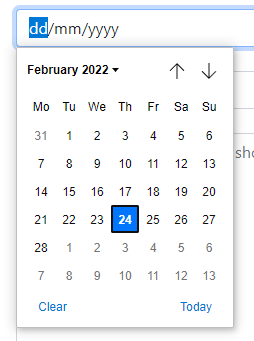
        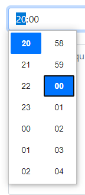

- **Reservation List**
    * The reservation tab lists all reservations attached to a specific user, if there are no reservations to display a button prompting the user to navigate to the 'make a booking' section is displayed. All the information for a specific reservation is displayed within a card, the status of the reservation is also highlighted here and is altered dependant upon the reservation being accepted or declined. Buttons to allow for amendments or cancellations are displayed within the card. Information provided in the special requirements field can be seen displayed in a modal. For canceling reservations the user is prompted via a modal again to ensure they definitely want to cancel. Validation checks are ran on the cancel and amend buttons to ensure the user making those requests is the owner of the reservation.

        * [Manage Bookings Issue](https://github.com/LewisCM14/restaurant-booking-app/issues/11)
        * [Alter/Cancel a Booking](https://github.com/LewisCM14/restaurant-booking-app/issues/4)
        * [View a Booking](https://github.com/LewisCM14/restaurant-booking-app/issues/3)
        ---
        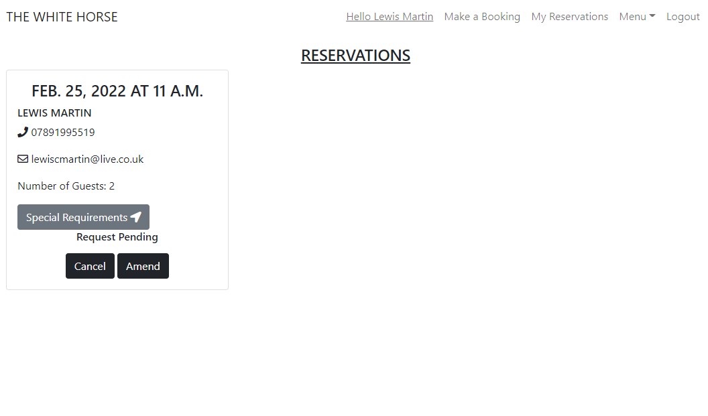
        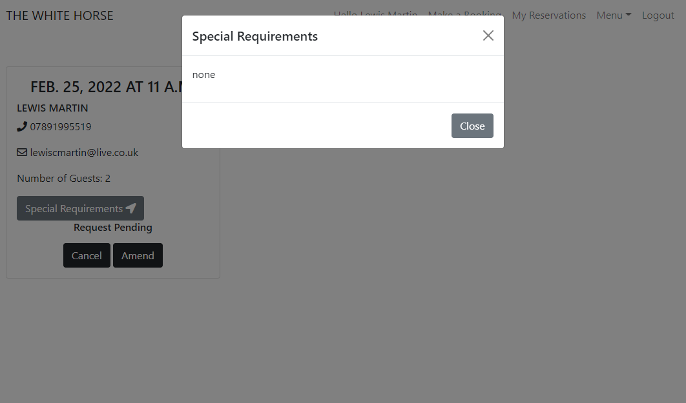
        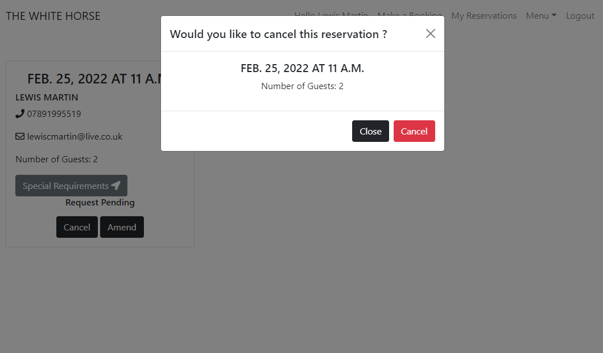

- **Menu**
    * The different catagories for the menu section of the site can be navigated to via the dropdown from the nav bar or between the buttons provided on the page for each individual section. The menu app is designed to meet the ever changing requirements of a modern business and allows for a user with admin privileges to adjust the menu as required. Each item is displayed as a card which details the: title, description and price. From within the admin panel the display property of the items can be checked on or off to handle different requirements according to specific days. Validation on the title of the item is preformed to prevent the same item being listed multiple times. The price field is also a decimal field which allows for a number up to 999 to be entered. There is also an option to upload a picture for each individual item, this field is intended for use with a future feature.

        * [View the Restaurant Menu](https://github.com/LewisCM14/restaurant-booking-app/issues/9)
        ---
        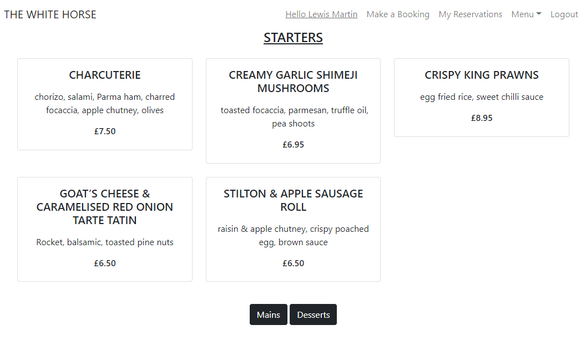
        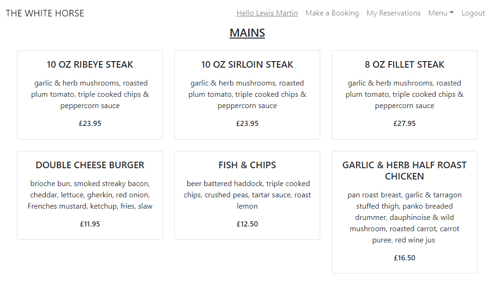
        

[Return to Table of Contents](#contents)
___
### Future Features 

*The product backlog can be viewed [here](https://github.com/LewisCM14/restaurant-booking-app/milestone/1).*

- **Write a Review**

    *An option for a user to write a review, which is then displayed on the site for other users to see. Due to the nature of the business this could potentially be handled through Trip Advisor or Yelp.*

- **Hero Image Carousel**

    *Developing the hero image on the landing page to make use of a carousel highlighting the restaurants dishes is another future feature to also implement, i feel this would be a more elegant and professional way of advertising the business at a glance.*

- **Automated Emails**

    *User receives automated emails whenever their booking is accepted.*

- **Images for the Menu Items**

    *Images relating to the menu items displayed to the user. For this feature i feel professionally taken images conforming to a set resolution would be required to achieve the best results.**

[Return to Table of Contents](#contents)
___
### Testing  

- **Bugs found in Development**

    * Commit [test_get_reservations method](https://github.com/LewisCM14/restaurant-booking-app/commit/93e8457c7c3c084fd03156ccd75e7e0d833fb7ff). 
       * Required user authorization after adjustments to the view logic.
    ---
    * The steps i took to resolve an issue with my hero image not rendering on my deployed site can be found below. This bug was due to me overlooking the need to setup the database and add the image on the deployed server.

        [1](https://github.com/LewisCM14/restaurant-booking-app/commit/15519a2696d58d73265eeb74614721021c11556d)
        [2](https://github.com/LewisCM14/restaurant-booking-app/commit/c91e3fab1bf0446df9645c9257b6b35941459669)
        [3](https://github.com/LewisCM14/restaurant-booking-app/commit/cabfd820fd7669d9c180cd763246729edcbd0464)
        [4](https://github.com/LewisCM14/restaurant-booking-app/commit/ade049d61731090343028ae32ea7a6e137f580b8)
        [5](https://github.com/LewisCM14/restaurant-booking-app/commit/a4ba0a2063a582dd549154c20cea5a41a0f88a5e)
    ---
    * Commit [reset booking database](https://github.com/LewisCM14/restaurant-booking-app/commit/87be28439bc26c411f032e2ca37cdc9ce3c32888) 
        * This was required after migrations regarding an arrival field was made that broke the functionality of the database.
    ---
    * Commit [update reservation status in amend_reservation view](https://github.com/LewisCM14/restaurant-booking-app/commit/b22497a4f3113841826d384cbed32bb7d1f62fc4) 
        * Whilst writing automated tests i noticed that amended bookings which had been accepted didn't have their status reverted back to pending once updated. This was an oversight on my part for not considering this when creating the view.
    ---
    * Commit [adjust redirect path in amend_reservations view](https://github.com/LewisCM14/restaurant-booking-app/commit/60b68846cf2ea42bf61a9f7cd9dd564e7200050d) 
        * This bug was due to me not considering that the user would be logged into an account so the login page wasn't an appropriate location to navigate to.

- **Validator Testing**

    - HTML
        - When passing the html templates relating to the menu app through the [W3C Validator tool](https://validator.w3.org/#validate_by_uri) via URL minor errors can be found,however when tested via direct input these issues are not raised. An issue relating to the Jinja templating language is raised via direct input but in this instance it can be ignored. Overall i decided that the the issues the validator tool was raising for: starters.html, mains.html and desserts.html did not require attention. All other html passed validation. The error raised via URL input can be seen below.

            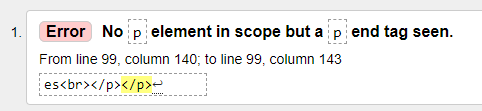

    - CSS
        - No errors were found when passing through the [W3C Validator tool](https://jigsaw.w3.org/css-validator/)

    - JAVASCRIPT
        - No custom Javascript is used in the project, so validator testing was not required.

    - Python
        - No errors were found when passing through the [PEP8 Validator tool](http://pep8online.com/). However pylint issues are raised within my IDE. These issues refer to my models having no 'Object' member. These issues are not raised when passing through the PEP8 validator so in this instance i chose to leave them.

- **Lighthouse**

- **Automated Tests**

    * Using the coverage package, i have generated reports for the booking and menu app. Automated test coverage for these two apps exceeded 90% which i deemed sufficient. Within the python files marked as starting with 'test' notes regarding how each individual test works and the logic behind why it achieves its goal can be found.
        
        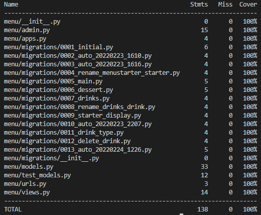
        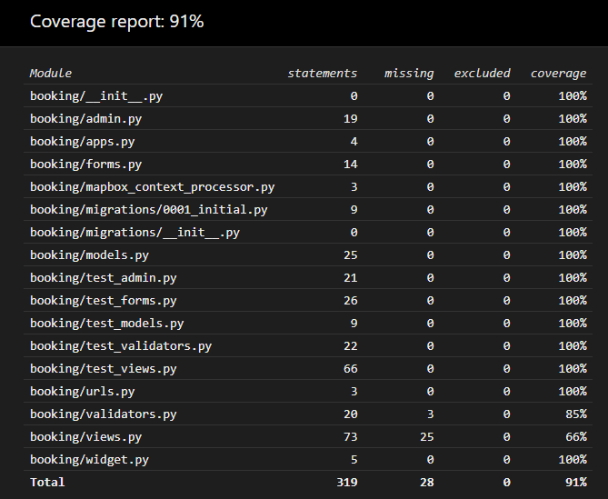

        The areas of code within the booking app that are not covered via my automated tests can be seen below. I felt testing these areas manually was sufficient, as they all preform as intended. With the code not covered within the booking and amend_booking views having validators and automated testing surrounding these already preformed on it.
        
        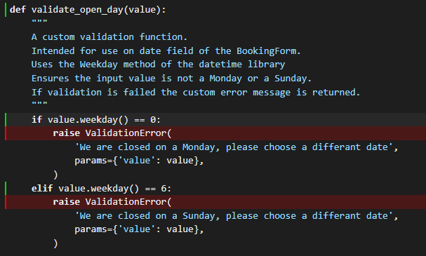
        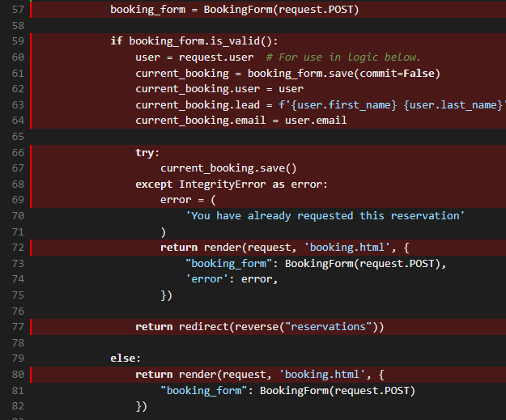

[Return to Table of Contents](#contents)
___
### Unfixed Bugs 

* MapBox Fails to Render.

    * Although the key for the deployed version of the project has URL restrictions set as per the MapBox [guidlines](https://docs.mapbox.com/accounts/guides/tokens/#url-restrictions) it sometimes fails to render within the browser and a new token must be made and the config vars within the app updated. I have reached out to MapBox customer service for advice on the issue. Upon failure to render 403 errors are logged within the console on devtools. Below the restrictions set and how the map should look rendered can be seen.

        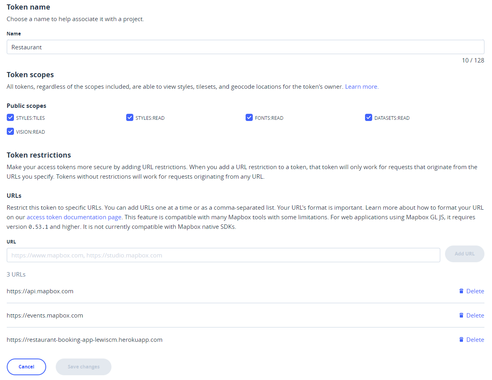
        

[Return to Table of Contents](#contents)
___
### Deployment 

- The site is deployed via [Heroku](https://heroku.com/). The steps to deploy are as follows:

    *It is assumed the GitHub repository for the project is setup correctly as this point.*
     
    *Ensure all requirements for the project are added to the requirements.txt file prior to deployment. The command **pip3 freeze --local > requirements.txt** can be ran in the terminal to do this.*

    *It is also assumed that the Django project is setup as intended, necessary dependencies installed with all apps required added to the INSTALLED_APPS variable within settings.py. For this project the booking app is all that is required.*

    * STAGE ONE - Create a New App in Heroku

        1: From the dashboard on Heroku, select New and then Create new app.
        
        2: Enter an individual app name into the text box, select a relevant region from the dropdown and then press Create app.
        
        3: A Heroku app has now been created.
    
    ---
    
    * STAGE TWO - Add a Database

        1: Navigate to the resources tab for the app that has just been created.

        2: In the Add-Ons section, search for the Heroku Postgres add on and submit an order form.
        
        3: Select the Settings tab for the app.

        4: Reveal Config Vars and copy the DATABASE_URL string provided.

        5: Create a env.py file within the project and use the copied string to create a DATABASE_URL environment variable. The Python OS module will be required for this.

        *The env.py file is used to protect keys which should only be viewed by the developer. This file will not be pushed to GutHub for public display.*

    ---
    
    * STAGE THREE - Create a SECRET_KEY

        1: Within the env.py file, create a SECRET_KEY environment variable. The string for this variable is decided by the developer.

        2: On the settings tab of the Heroku app, reveal config vars and add the SECRET_KEY variable along with the corresponding string.

    ---
    
    * STAGE FOUR - Update the settings.py file

        1: Import dj_database_url and env.py into the settings.py file within the project.

            import dj_database_url
            if os.path.isfile('env.py'):
                import env

        2: Update the default SECRET_KEY variable provided by Django to the SECRET_KEY environment variable.

            SECRET_KEY = os.environ.get('SECRET_KEY')

        3: Using an if/else statement update the DATABASES dictionary for the deployed project to use the DATABASE_URL environment variable, the dj_database_url library is utilized here.

            if development:
                DATABASES = {
                    'default': {
                        'ENGINE': 'django.db.backends.sqlite3',
                        'NAME': BASE_DIR / 'db.sqlite3',
                    }
                }
            else:
                DATABASES = {
                    'default': dj_database_url.parse(os.environ.get('DATABASE_URL'))
            }
        
        *The database for developing the project remains as the sqlite one provided*

        4: Preform a migration.

        *The Heroku database is now being used as the backend, within the resources tab of the app, the Heroku Postgres link will bring up a window demonstrating this.*

    ---

    * STAGE FIVE - Connect app to Cloudinary

        *This Stage assumes you have a Cloudinary account setup already.*

        1: On the Cloudinary website, copy the API environment variable string.

        2: Within the projects env.py file create a CLOUDINARY_URL environment variable equal to this copied string.

        3: Within the Heroku app, on the settings tab, update the config vars to contain this variable.

        *For initial deployment, a variable called DISABLE_COLLECTSTATIC is also created within the config vars at this point with a value of 1, this is simply to get the skeleton project deployed for testing purposes and removed when deploying the completed project*

        4: Within the settings.py file on the project, under INSTALLED_APPS, 'cloudinary_storage' and 'cloudinary' must be added.

        5: Django must then be told to use Cloudinary to store media and static files, this is done by adding the below variables to the relevant section of the settings.py file:
            
            STATICFILES_STORAGE = 'cloudinary_storage.storage.StaticHashedCloudinaryStorage'
            STATICFILES_DIRS = [os.path.join(BASE_DIR, 'static')]
            STATIC_ROOT = os.path.join(BASE_DIR, 'staticfiles')
            MEDIA_URL = '/media/'
            DEFAULT_FILE_STORAGE = 'cloudinary_storage.storage.MediaCloudinaryStorage'
        
        *The app is now linked to Cloudinary*
    
    ---
     
    * STAGE SIX - Tell Django where the templates are stored

        1: Under the BASE_DIR on settings.py, add in the below templates directory. 
        
            TEMPLATES_DIR =  os.path.join(BASE_DIR, 'templates')
        
        2: Then within the TEMPLATES setting, update the DIRS key to point towards this variable.

            'DIRS': [TEMPLATES_DIR]
    
    ---
    
    * STAGE SEVEN - Update ALLOWED_HOSTS

        1: At this point, within settings.py, set the DEBUG variable to development.

        2: Using an if/else statement update the ALLOWED_HOSTS variable for the deployed project to be the name of your Heroku app with ".herokuapp.com" appended to the end.

            DEBUG = development

            if development:
                ALLOWED_HOSTS = [
                    'localhost',
                ]
            else:
                ALLOWED_HOSTS = ['restaurant-booking-app-lewiscm.herokuapp.com']

        *For development the host is set to localhost, so that the project can be ran locally. This is also a good point to add the Media, Static and Template directories, these folders should be added at the top level.*
    
    ---
    
    * STAGE EIGHT - Create a Procfile

        1: Create a Procfile at the top level of the directory.

        2: Within this file, declare the below command. This command ensures gunicorn is used as the web server.

            web: gunicorn restobook.wsgi
        
        *Add, commit and push to the repository at this point*
    
    ---
    
    * STAGE NINE - Connect the GitHub repository to the Heroku App

        1: Within the Deploy tab on the Heroku app, choose GitHub as the deployment method.

        2: Search for the correct repository and connect.

        3: At the bottom of the deployment section there is an option to chose which branch to deploy. Chose the main branch and allow the build log to complete.

        4: Once complete, chose to allow automatic deployment from here onwards.

        *The app has now been deployed successfully. The live link can be found here - [restaurant-booking-app](https://restaurant-booking-app-lewiscm.herokuapp.com/)*

        **Be aware, from this point onwards, all changes made to the database in development will have to be migrated to the deployed database separately in order to take effect. This can be done by changing the DATABASES dictionary in the settings.py file to point directly at the heroku database, DO NOT commit to GitHub with this setting saved.**

    ---
[Return to Table of Contents](#contents)
___

## Create a Local Clone 

- Follow the steps below in order to create a local clone using HTTPS.

    * STEP ONE - Navigate to the GitHub repository for the project. Located [here](https://github.com/LewisCM14/restaurant-booking-app).
    
    * STEP TWO - From the tabs displayed, click the **Code** tab. This presents a drop down menu.

    * STEP THREE - Ensure this menu is on the **HTTPS** tab and copy the URL.

    * STEP FOUR - On your chosen IDE open Git Bash, Change the current working directory to the location where you want the cloned directory.
    
    * STEP FIVE - Type git clone, and then paste the URL you copied earlier.

            $ git clone https://github.com/LewisCM14/restaurant-booking-app.git
    
    * STEP SIX - Press Enter to create your local clone.

    *If GitPod is your chosen IDE from the link above the Gitpod button can be clicked to open up the repository code on your local machine* 

[Return to Table of Contents](#contents)
___
## Technologies Used 

- **Languages Used**

    * HTML
    * CSS
    * JAVASCRIPT
    * PYTHON
    * MARKDOWN

- **Frameworks & Toolkits**

    * **[Django 3.2](https://www.djangoproject.com/download/).**
        * Python based web framework, used to build the application.
    
    * **[Bootstrap](https://getbootstrap.com/).**
        * A front-end open source toolkit, used across the application.
    
    * **[Font Awesome](https://fontawesome.com/).**
        * Icon set and toolkit used across the application.

- **DBMS**
    
    * **[PostgreSQL](https://www.postgresql.org/).**
        * The relational database management system used.

- **Cloud Services**

    * **[Heroku](https://id.heroku.com/login).**
        * Used to deploy my project.

    * **[Cloudinary](https://cloudinary.com/).**
        * A cloud-based image and video management service. Used due to Heroku using an ephemeral file system. 

- **Server**

    * **[Gunicorn](https://gunicorn.org/).**
        * The server used to run Django on Heroku.

- **Version Control**
    
    * **Git.**
        * Git was used for version control by utilizing the GitPod terminal to commit to Git and Push to GitHub.

    * **[GitHub](https://github.com/).**
        * GitHub is used to store the projects code after being pushed from Git.
    
    * **[Gitpod](https://www.gitpod.io/docs/).**
        * The IDE used to build the project.

- **Libraries, Packages and Applications**

    * **[dj_database_url](https://pypi.org/project/dj-database-url/).**
        * A PostgreSQL supporting library. Allows you to utilize the 12factor inspired DATABASE_URL environment variable to configure your Django application.
    
    * **[pyscopg2](https://www.psycopg.org/docs/).**
        * PostgreSQL database adapter for the Python programming language.
    
    * **[dj3-cloudinary-storage](https://pypi.org/project/dj3-cloudinary-storage/).**
        * a Django package that facilitates integration with Cloudinary.
    
    * **[allauth](https://django-allauth.readthedocs.io/en/latest/installation.html).**
        * Used for creation and maintenance of user accounts.
    
    * **[crispy-forms](https://django-crispy-forms.readthedocs.io/en/latest/index.html).**
        * Used for rendering the booking form in the browser.
    
    * **[coverage](https://coverage.readthedocs.io/en/6.3/).**
        * Used to access the coverage of my automated tests for the python code i've wrote.
    
    * **[summernote](https://github.com/summernote/django-summernote).**
        * Used as the WYSIWYG editor from inside the admin panel on the menu app.
    
- **Programs**

    * **Slack.**
        * Specifically the peer-code_review channel on Code Institutes Slack workspace. Used to increase the scope of my testing.
    
    * **Balsamiq.** 
        * Used to create the wire frames during the development process.

    * **[Iconifier](https://iconifier.net/).**
        * Used to convert the favicon image to the correct size and file type.
       
[Return to Table of Contents](#contents)
___
## Credits  

* A special thank you to my mentor Rohit Sharma. 

* Thanks to the Code Institute tutor support team, who helped me develop my understanding throughout this project.

* Finally thanks to my peers on Slack who responded to my questions.  

- **Content**

    * I used this [video](https://www.youtube.com/watch?v=AuNjaMLwuug/) to help me wire up my views.

    * The footer is developed from a template on [MDBootstrap](https://mdbootstrap.com/docs/standard/navigation/footer/).

    * To adjust the base allauth sign up form i used this [post](https://www.geeksforgeeks.org/python-extending-and-customizing-django-allauth/) to write my custom class and this [post](https://stackoverflow.com/questions/55786710/using-multiple-login-fields-email-or-phone-number-in-django-all-auth) to further develop it. I then used this [post](https://stackoverflow.com/questions/23956288/django-all-auth-email-required) on StackOverflow to adjust my allauth configuration.

    * I used this [video](https://www.youtube.com/watch?v=4sosXZsdy-s) to further my understanding of Bootstrap5, particularly when developing my Special Requirements modal. 

    * I used this [post](https://stackoverflow.com/questions/4101258/how-do-i-add-a-placeholder-on-a-charfield-in-django) on StackOverflow to help me add placeholder text to my BookingForm.

    * I used this [post](https://philipwalton.github.io/solved-by-flexbox/demos/sticky-footer/) by [Philip Walton](https://philipwalton.com/) to make my footer stick to to bottom of the browser view.

    * I used this [post](https://www.culturefoundry.com/cultivate/technology/bottom-align-an-element-with-flexbox/) by Josh Coast to refresh my knowledge on flex-box when styling my hero image on the index page.

    * I used this [post](https://www.section.io/engineering-education/uploading-images-to-cloudinary-from-django-application/) by [Shuaib Oseni](https://www.section.io/engineering-education/authors/shuaib-oseni/) in order to setup the methods for storing the images used for my project on cloudinary.

    * I used this [post](https://simpleisbetterthancomplex.com/tutorial/2019/01/03/how-to-use-date-picker-with-django.html#xdsoft-datetimepicker) by Vitor Freitas to add the XDSoft datetime picker tool to my booking form. **Later Removed**

    * I used this [post](https://nancylin.xyz/how-to-implement-date-time-picker-in-django-without-javascript/) by [Nancy Lin](https://nancylin.xyz/) to alter my datetime picker to the inbuilt Django one.

    * I used this [post](https://www.delftstack.com/howto/django/django-phone-number-field/) on delftstack to setup the RegexValidator for my mobile field on the Booking model.

    * I followed this [video](https://www.youtube.com/watch?v=J0E-1eYeLlM) for adding the MapBox API to my footer, i then followed the steps listed on this [post](https://stackoverflow.com/questions/52030957/how-to-hide-google-map-api-key-in-django-before-pushing-it-on-github) from StackOverflow to prevent my unique MapBox access token being public.

    * I used this [post](https://betterprogramming.pub/django-quick-tips-context-processors-da74f887f1fc) by [Farel Ellely](https://edy-ellely.medium.com/) to develop the logic for wiring up my mapbox_context_processor.

    * I used this [post](https://stackoverflow.com/questions/53533990/bootstrap-2-modals-on-1-page) on StackOverflow to help me add a second modal to my reservations.html template.

    * I used this [post](https://stackoverflow.com/questions/11293380/django-catching-integrity-error-and-showing-a-customized-message-using-template) on StackOverflow for help handling the IntegrityError raised when the unique_booking constraint fails in the Booking model.

    * I used this [post](https://stackoverflow.com/questions/21938028/how-can-i-get-a-favicon-to-show-up-in-my-django-app) on StackOverflow to guide me in linking up the favicon on my project.

    * I watched this [video](https://www.youtube.com/watch?v=iJKIxrJ40ss) to expand my knowledge on GitHub branches. I then read this [post](https://devconnected.com/how-to-switch-branch-on-git/) to learn how to switch between branches using git from inside my IDE.

- **Media**

    * The hero image used on the index page is a free to use stock photo found [here](https://unsplash.com/photos/-YHSwy6uqvk) on [unsplash](https://unsplash.com/). The photo was taken by [Lily Banse](https://unsplash.com/@lvnatikk).

    * The image used as the favicon was taken from [here](https://www.seekpng.com/ipng/u2q8e6a9q8a9w7y3_dancing-black-horse-shape-of-side-view-comments/) on [Seekpng](https://www.seekpng.com/).

[Return to Table of Contents](#contents)
___